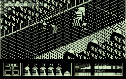

# ZXemul

## ZX Spectrum 48k emulator for Psion SIBO devices

This repository contains source code for ZXEmul - ZX Spectrum emulator for Psion SIBO devices (Psion 3a, Psion 3c and Psion 3mx). The emulator was designed, developped and tested from July to December 2000 in Prague, Czech Republic and released as freeware on Christmas 2000.

## Features

* compatible with Psion 3a, Psion 3c and Psion 3mx
* highly optimized emulation core written completely in assembler
* undocumented Z80 instructions and R register fully supported
* 3 color modes (INK, Black & White, Gray)
* 3 screen mapping modes (Pan, Shrink, Fit)
* simulation of Kempston, Cursor, Fuller and Sinclair joysticks with keys
* 70-110% speed of original ZX Spectrum on Psion 3mx
* loading and saving of .Z80 and .SNA file formats
* built-in Spectrum keyboard layout help screen for BASIC fans

 &nbsp; &nbsp; 

 &nbsp; &nbsp; 

## Emulator architecture

To maximize the emulation speed, the emulation core is written as Psion SIBO logical device driver (LDD) in Intel 8086 assembler, with direct access to device memory and screen. The emulator itself is HWIM SIBO C application, which opens and calls the emulation core device driver. There is also a MS-DOS version of ZXEMUL, which links to the same emulation core, but can be run directly on PC for debugging.

The Z80 processor instructions are emulated, one by one, on the 16-bit 8086 CPU compatible CPU of Psion. Registers AF, BC, HL, SP and PC are mapped directly onto 8086 registers, others must use memory for storage. To decode instructions as fast as possible, the fetch and jump to table code is copied at the end of the most frequently used instructions (this saves final JMP). The code uses TASM macros extensively to simplify encoding of all instruction variants.

The final speed of emulation depends on the code being run, type of instructions and difficulty to precisely emulate them on 8086. With the help of Psion 3mx CPU clocked at 27 MHz, the emulation of Z80 clocked at 3.5 MHz can run in realtime speed.

The drawing routines are optimized for the selected mode and they convert ZX Spectrum memory area directly into Psion display area in memory. The emulation is run for given amount of instructions, then the display is updated, input/output state read/written, and INTs generated. 

The original ZX Spectrum ROM uses code which tries to overwrite the ROM itself. As the emulator has no memory protection implemented, the ROM is patched on load to prevent this.

## How to build it yourself

Please note that to build the emulator for yourself, you will need the Psion SIBO SDK tools. I do not own it anymore, neither I own Borland's TASM and C MS-DOS compilers, so I cannot verify the completeness of the code released. 

## Binaries

Download the [original released ZXEMUL.ZIP](release/zxemul.zip), which contains the instructions how to install the emulator onto Psion device.
